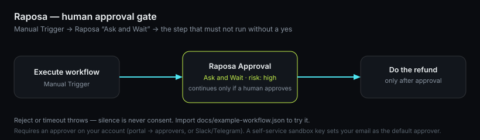

# n8n-nodes-raposa

An [n8n](https://n8n.io) community node for **Raposa Aval** — a human approval layer for AI agents. Put it in front of any step that moves money or changes something irreversible: the workflow pauses until an authorised person approves, and the decision is sealed in a hash-chained audit log you can export and verify.

## Before your first run — you need an approver

**Ask and Wait** only completes when a human presses **Approve**. That human is an *approver* on your Raposa account (a console login, or a linked Slack/Telegram). **If your account has no approver, the request has no one to go to and can only run to timeout** — that is the single most common reason a first run never succeeds.

- **Self-service sandbox key** ([raposa.group/start?plan=sandbox](https://raposa.group/start/?plan=sandbox)): your own email is set as the **default approver** automatically. You will receive an approve/reject link by email on your first request — no extra setup.
- **Removed it, or want more people?** Add approvers (or connect Slack/Telegram) in your account: [dcescrypt.com/api/portal](https://dcescrypt.com/api/portal). See [Who approves](https://raposa.group/docs/#who-approves).

From **0.1.6**, *Ask and Wait* checks for an approver first and fails immediately with a clear message instead of hanging for the full timeout.

## Try it in two minutes

Import [`docs/example-workflow.json`](docs/example-workflow.json) (**Workflows → ⋯ → Import from File**), pick your Raposa credential on the middle node, and run it.



## Operations

| Operation | What happens |
|---|---|
| **Ask and Wait** | Creates the approval, polls until a human approves or rejects. Timeout is an error — silence never counts as approval. Rejection fails the workflow unless you turn *Fail on Reject* off and route on `status` yourself. |
| **Create** | Creates the approval and returns its `id` immediately. Give a *Webhook URL* to receive the HMAC-signed decision instead of polling. |
| **Get** | Reads an approval by `id`. |

## Credentials

*Raposa API*: base URL (default `https://dcescrypt.com/api`) and your client API key. The credential test calls `GET /v1/me`.

Get a free sandbox key at https://raposa.group/start/?plan=sandbox — you receive a one-time reveal link by email in seconds (100 approvals/month, no card), and your email is set as the default approver so your first *Ask and Wait* can be approved right away.

> Note on domains: the product is **Raposa**, run on **DC ESCRYPT** infrastructure. You request the key at `raposa.group`, and the API base URL in the credential is `dcescrypt.com/api` — that is expected, not a mistake.

## Install

Self-hosted n8n: **Settings → Community Nodes → Install** → `n8n-nodes-raposa`.

## Develop

```bash
npm install
npm test        # builds, then runs the behaviour tests against a fake API
```

## Links

- Docs: https://raposa.group/docs/
- Legal (DPA, sub-processors): https://dcescrypt.com/legal/

MIT © DC ESCRYPT SL
